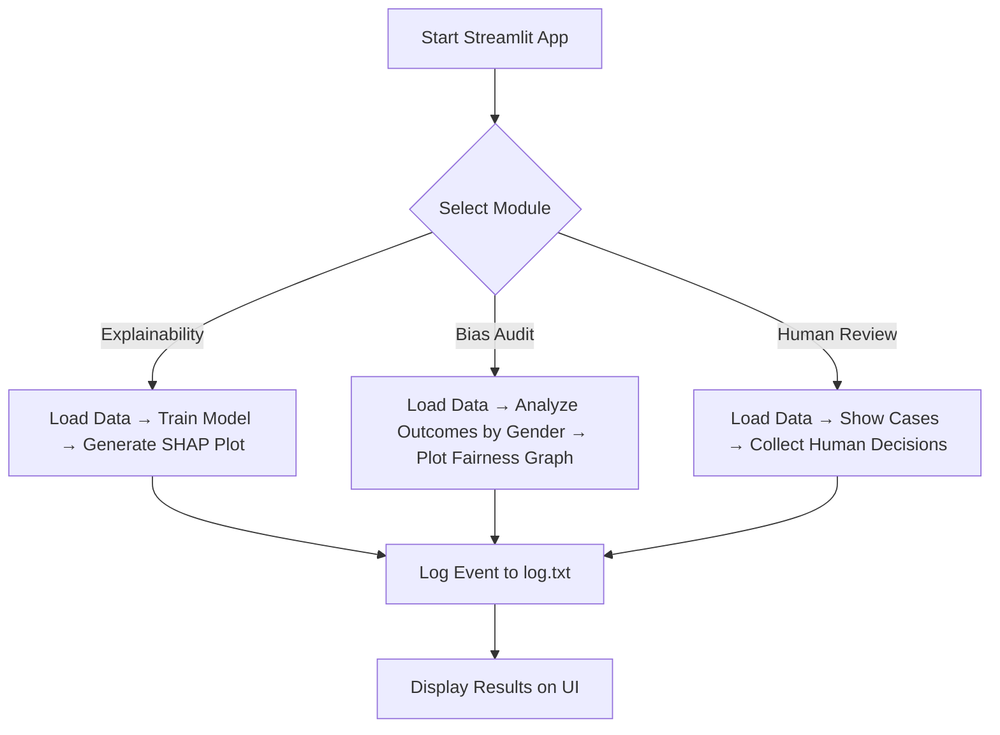

# 🛡️ MedExplain - AI Oversight System for Healthcare

MedExplain is an agentic AI oversight framework designed to bring **transparency**, **fairness**, and **human validation** to healthcare ML workflows. It helps healthcare organizations and AI research teams audit and validate their predictive models with confidence.

---

## 🎯 Key Features

🔍 **Explainability**

- SHAP-based visual interpretation of model predictions.
- Waterfall plots to reveal feature contribution.

⚖️ **Bias & Fairness Audit**

- Analyzes model outcome distribution by sensitive attributes like gender.
- Highlights any demographic disparities.

👨‍⚕️ **Human-in-the-loop Review**

- Doctors or reviewers manually verify AI predictions.
- Interactive UI for Accept/Reject decisions per patient.

📝 **Event Logging**

- Logs every action taken (review, audit, explainability) for traceability.

---

## 📦 Project Structure

```
MedExplain/
├── app.py                       # Streamlit frontend
├── modules/                    # Functional Modules
│   ├── explainability.py       # SHAP explanation
│   ├── bias_audit.py           # Fairness visualization
│   ├── human_review.py         # Reviewer UI
│   └── logger.py               # Event logging
├── utils/
│   ├── data_loader.py          # Loads patient dataset
│   └── sample_data.csv         # Sample mock patient data
├── static/                     # (Optional) assets/static files
├── requirements.txt
└── README.md
```

---

## 🚀 How to Run

```bash
# Step 1: Install dependencies
pip install -r requirements.txt

# Step 2: Run the app
streamlit run app.py
```

---

## 📊 Example: SHAP Waterfall Plot


---

## 📁 Sample Dataset Format

```csv
Age,Gender,Glucose,BloodPressure,BMI,Outcome
35,Male,120,80,28.5,1
50,Female,110,70,24.0,0
...
```

---

## 🔄 System Flow Diagram

Below is a high-level flow of how MedExplain functions:



## 💡 Use Cases

- Clinical risk prediction oversight
- Healthcare bias auditing
- Transparent AI deployments in hospitals
- Research reproducibility

---

## 📬 Contributing

We welcome contributions! Feel free to:

- Raise an issue 🐛
- Suggest a feature 💡
- Open a PR 🚀

---

## 📜 License

This project is licensed under the [MIT License](LICENSE).

---

Built with ❤️ for responsible AI in healthcare.
